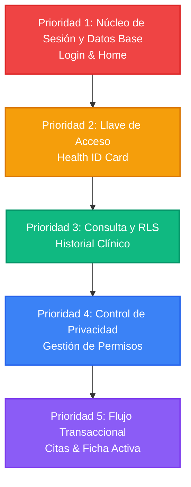

# Ruta de Prioridades y Prevención de Conflictos en la App Móvil

Este documento define la **prioridad de desarrollo, revisión y pruebas** para las pantallas de la aplicación móvil de **Bolivia Health ID**. Su objetivo principal es asegurar una experiencia estable y fluida en la feria universitaria de la UTEPSA, evitando "crashes" (cierres inesperados) de navegación o inconsistencias ("choques") de estados de datos con Supabase.

---

## 1. Mapa de Prioridades

Para garantizar la estabilidad del sistema, las pantallas deben verificarse y depurarse en el siguiente orden jerárquico. Cada nivel actúa como cimiento para el siguiente:

---

## 2. Detalle de Prioridades y Estrategia de Mitigación de Errores

### 🔴 Prioridad 1: Autenticación, Estado Global y Sesión
* **Pantallas Involucradas:** [LoginScreen.tsx](file:///d:/Bolivia_Health_ID/mobile/src/screens/LoginScreen.tsx) y [HomeScreen.tsx](file:///d:/Bolivia_Health_ID/mobile/src/screens/HomeScreen.tsx)
* **¿Por qué es crítico?:** Si el paciente ingresa a la aplicación sin una sesión autenticada en Supabase o sin inicializar la wallet en el almacenamiento persistente (`AsyncStorage`), las pantallas posteriores intentarán consultar datos con valores `null` o vacíos, provocando un **cierre inmediato de la aplicación (crash)**.
* **Estrategia para evitar choques/crashes:**
  - **Estado de Carga (Loading State):** Implementar pantallas de carga completas mientras se verifica `supabase.auth.getSession()` antes de montar el componente visual de `HomeScreen`.
  - **Fallback de Datos:** Si el perfil del paciente no carga a tiempo, usar un perfil "Mock" temporal controlado en lugar de dejar que las variables queden `undefined`.

### 🟠 Prioridad 2: Identidad de Salud (Health ID)
* **Pantallas Involucradas:** [HealthIDScreen.tsx](file:///d:/Bolivia_Health_ID/mobile/src/screens/HealthIDScreen.tsx)
* **¿Por qué es crítico?:** Genera la credencial digital (QR) que el médico escaneará desde su portal web. Si el QR no carga, el flujo completo entre médico y paciente se detiene en seco.
* **Estrategia para evitar choques/crashes:**
  - **Robustez del código QR:** Asegurarse de que el componente de código QR reciba una cadena de texto válida (`wallet_address`). Si la dirección está en proceso de carga, mostrar un esqueleto de carga visual en su lugar.
  - **Datos Críticos Locales:** Almacenar datos vitales rápidos (tipo de sangre, alergias) localmente una vez descargados para que sigan visibles aunque se pierda la conexión a internet.

### 🟢 Prioridad 3: Historial Clínico (Lectura Segura)
* **Pantallas Involucradas:** [HistorialScreen.tsx](file:///d:/Bolivia_Health_ID/mobile/src/screens/HistorialScreen.tsx)
* **¿Por qué es crítico?:** Es la pantalla con mayor densidad de datos. Consultas directas a Supabase sin control de excepciones pueden crashearse si la base de datos devuelve un error de políticas RLS (Row Level Security) o registros vacíos.
* **Estrategia para evitar choques/crashes:**
  - **Manejo de Errores en Supabase:** Envolver la llamada `.from('health_records')` en un bloque `try/catch` y validar siempre `if (error)` mostrando un mensaje amigable en la UI en lugar de romper el renderizado.
  - **Lista Vacía Graciosa:** Si el paciente no tiene diagnósticos previos, mostrar una ilustración limpia o un mensaje ("Aún no tienes registros médicos registrados") en lugar de una pantalla en blanco.

### 🔵 Prioridad 4: Gestión de Permisos (Control de Acceso)
* **Pantallas Involucradas:** [PermisosScreen.tsx](file:///d:/Bolivia_Health_ID/mobile/src/screens/PermisosScreen.tsx)
* **¿Por qué es crítico?:** Si un paciente revoca el permiso de un médico y éste último intenta leer sus datos simultáneamente desde el portal web, la base de datos denegará el acceso.
* **Estrategia para evitar choques/crashes:**
  - **Optimismo en la UI vs. Confirmación Real:** Al presionar "Revocar", deshabilitar el botón inmediatamente para evitar clics dobles que generen peticiones duplicadas y errores HTTP 409 (Conflicto) en Supabase.
  - **Sincronización:** Asegurar que al revocar el permiso, la pantalla actualice localmente su estado mediante filtros en lugar de recargar de golpe toda la base de datos.

### 🟣 Prioridad 5: Flujo de Citas e Indicador de Ficha Activa
* **Pantallas Involucradas:** [SolicitarFichaScreen.tsx](file:///d:/Bolivia_Health_ID/mobile/src/screens/SolicitarFichaScreen.tsx), [DoctorProfileScreen.tsx](file:///d:/Bolivia_Health_ID/mobile/src/screens/DoctorProfileScreen.tsx) y [FichaActivaScreen.tsx](file:///d:/Bolivia_Health_ID/mobile/src/screens/FichaActivaScreen.tsx)
* **¿Por qué es crítico?:** Involucra la creación de nuevos registros (Escritura en Supabase). Conflictos de horarios, doctores sin disponibilidad cargada o pérdida de conexión durante el registro pueden duplicar citas o generar datos corruptos.
* **Estrategia para evitar choques/crashes:**
  - **Deshabilitar envíos múltiples:** Bloquear los botones de confirmación ("Reservar Ficha") y mostrar un spinner de carga para impedir que el usuario pulse varias veces.
  - **Parámetros de Navegación Seguros:** Al navegar a `FichaActiva` o `DoctorProfile`, nunca asumir que el objeto `doctor` o `cota` contiene todos los atributos. Utilizar encadenamiento opcional (`doctor?.full_name`) para evitar errores de lectura sobre variables nulas.

---

## 3. Lista de Verificación Cruzada (Checklist) para Evitar Conflictos

Antes de la demostración en la feria, se debe realizar este checklist técnico sobre el código:

- [ ] **Validar imports:** Comprobar que no existan dependencias duplicadas o imports rotos tras reestructurar la navegación (ej: el error de `Platform` corregido en `HistorialScreen.tsx`).
- [ ] **Encadenamiento opcional (`?.`):** Verificar que todas las lecturas de propiedades en listas dinámicas (ej: `item.doctor.name`) usen `item?.doctor?.name`.
- [ ] **Control del Ciclo de Vida:** Las pantallas críticas deben refrescar sus datos usando el listener `focus` de React Navigation (`navigation.addListener('focus', ...)`), garantizando que si el médico cambia el estado de una ficha a "En Consulta", la app del paciente se entere en cuanto abra la pestaña.
- [ ] **Manejo de Temas (Colors):** Que todos los componentes de texto usen `<Text style={{ color: theme.textPrimary }}>` en lugar de estilos quemados (`color: '#000'`) para prevenir textos invisibles en pantallas en modo oscuro.
