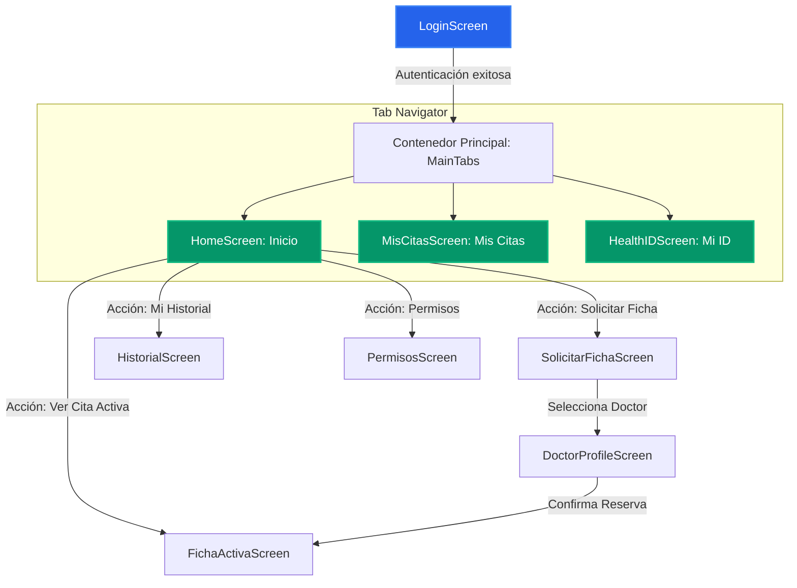

# Bolivia Health ID - Requisitos Funcionales y Guía de Pantallas (App Móvil)

Este documento detalla los **Requisitos Funcionales** y la estructura de **Pantallas** que conforman la aplicación móvil de **Bolivia Health ID**, un sistema de identidad digital y gestión de fichas médicas diseñado para la feria universitaria de la UTEPSA en Bolivia.

---

## 1. Requisitos Funcionales Generales

La aplicación móvil de Bolivia Health ID está orientada a los pacientes y debe cumplir con los siguientes requisitos funcionales transversales:

1. **Gestión de Identidad y Autenticación:**
   - Registro e inicio de sesión seguro de pacientes mediante correo y contraseña.
   - Generación de un código QR único que representa el "Health ID" (Identidad de Salud) del paciente.
2. **Gestión de Fichas y Turnos (Citas):**
   - Búsqueda de centros de salud, especialidades médicas y doctores disponibles en el sistema.
   - Solicitud de fichas de atención médica para el mismo día o programadas.
   - Visualización y seguimiento en tiempo real del estado de la ficha (posición en cola y tiempo estimado de espera).
3. **Historial Clínico Digital:**
   - Consulta centralizada y cronológica de consultas previas, diagnósticos, recetas y recomendaciones médicas.
4. **Control de Acceso y Consentimiento (Privacidad):**
   - Otorgar y revocar permisos de visualización del historial clínico a médicos específicos en tiempo real.
   - Registro de auditoría visible para el paciente sobre quién ha accedido a sus datos médicos.
5. **Asistencia en Emergencias (SOS):**
   - Acceso rápido a números de emergencia de Bolivia (Ambulancias, Policía, Bomberos).
   - Visualización de la "Ficha de Emergencia" (tipo de sangre, alergias principales) sin necesidad de internet o procesos complejos.

---

## 2. Mapa y Flujo de Pantallas

La aplicación se estructura en un flujo que combina un **Tab Navigator (Barra de Navegación Inferior)** para el acceso diario y un **Stack Navigator** para las pantallas de flujo profundo.

---

## 3. Detalle de Pantallas y Funcionalidades

### 3.1. [LoginScreen](file:///d:/Bolivia_Health_ID/mobile/src/screens/LoginScreen.tsx)
* **Objetivo:** Autenticación y acceso seguro del paciente al ecosistema.
* **Funcionalidades Clave:**
  - Formulario de entrada: Correo electrónico y contraseña.
  - Validación en tiempo real de campos obligatorios y formato de correo.
  - Conexión con el servicio de autenticación de Supabase.
  - Diseño minimalista con soporte para temas claro/oscuro (Dark Mode).

### 3.2. [HomeScreen](file:///d:/Bolivia_Health_ID/mobile/src/screens/HomeScreen.tsx)
* **Objetivo:** Panel de control principal (Dashboard) con accesos rápidos a las funciones clave del paciente.
* **Funcionalidades Clave:**
  - **Cabecera Dinámica:** Saludo personalizado al paciente con su foto de perfil y ubicación actual en Bolivia.
  - **Accesos Rápidos a Módulos:**
    - Botón para solicitar fichas médicas.
    - Botón para ver la ficha activa en curso.
    - Botón directo para revisar el historial médico.
    - Botón de control de permisos a médicos.
  - **Tarjeta de Ficha en Curso:** Si el paciente tiene una ficha para el día de hoy, se muestra un widget interactivo con la hora de su cita, el consultorio y la opción de ver el ticket en vivo.
  - **Módulo de Emergencia SOS (Modal):**
    - Botón flotante rojo / prominente de SOS.
    - Al presionarlo, abre un modal táctil con opciones para realizar llamadas telefónicas directas a emergencias de Bolivia (SAMU 168, Policía 110, Bomberos 119).
    - Muestra los datos vitales críticos del paciente (Grupo Sanguíneo, Alergias severas, Medicamentos controlados y Contacto de Emergencia) de forma inmediata.

### 3.3. [SolicitarFichaScreen](file:///d:/Bolivia_Health_ID/mobile/src/screens/SolicitarFichaScreen.tsx)
* **Objetivo:** Permitir al usuario reservar una ficha médica de forma ágil e intuitiva.
* **Funcionalidades Clave:**
  - **Buscador y Filtros:**
    - Selección de Centro Médico / Hospital.
    - Selección de la Especialidad Médica requerida (Medicina General, Pediatría, Ginecología, etc.).
  - **Listado de Doctores Disponibles:**
    - Muestra foto, nombre y calificación del médico.
    - Indica el precio de la consulta y el horario disponible.
  - **Selección de Fecha y Turno (Hora):**
    - Calendario interactivo para programar la cita.
    - Selección de bloques horarios disponibles en tiempo real.
  - **Integración Estética:** Iconografía basada en `lucide-react-native` (sin emojis informales) y compatibilidad total con Dark Mode.

### 3.4. [DoctorProfileScreen](file:///d:/Bolivia_Health_ID/mobile/src/screens/DoctorProfileScreen.tsx)
* **Objetivo:** Mostrar información detallada sobre el médico seleccionado antes de confirmar la cita.
* **Funcionalidades Clave:**
  - **Diseño Hero con Degradados:** Cabecera con degradado visual estético e imagen del médico destacada.
  - **Información del Médico:** Biografía, años de experiencia, universidad de egreso, especialidades y opiniones de otros pacientes.
  - **Ubicación y Consultorio:** Dirección exacta del consultorio dentro del hospital.
  - **Acción Principal:** Botón destacado para proceder con la reserva de la ficha médica.

### 3.5. [FichaActivaScreen](file:///d:/Bolivia_Health_ID/mobile/src/screens/FichaActivaScreen.tsx)
* **Objetivo:** Funcionar como el "Ticket Virtual" dinámico del paciente cuando está esperando atención en la clínica.
* **Funcionalidades Clave:**
  - **Diseño de Tarjeta Digital:** Estética inspirada en tarjetas virtuales (como Apple Wallet) con la información del hospital, doctor, consultorio y número de ficha.
  - **Seguimiento de Cola en Tiempo Real:**
    - Indicador visual del estado de la ficha (Ej: *En Espera*, *Llamado*, *En Consulta*, *Finalizado*).
    - Contador de pacientes pendientes adelante en la cola (Ej: "Hay 3 personas antes de ti").
    - Estimación dinámica del tiempo restante de espera.
  - **Código QR del Ticket:** Generación de un código QR específico para que el personal de recepción o el médico escanee la ficha al momento de ingresar a la consulta.
  - **Instrucciones Dinámicas:** Indicaciones de preparación (Ej: "Por favor, acércate al consultorio 4").

### 3.6. [MisCitasScreen](file:///d:/Bolivia_Health_ID/mobile/src/screens/MisCitasScreen.tsx)
* **Objetivo:** Mostrar de forma organizada las citas del paciente clasificándolas por vigencia.
* **Funcionalidades Clave:**
  - **Pestañas Internas (Segmented Control):**
    - Pestaña de "Próximas" citas / fichas programadas.
    - Pestaña de "Historial" de citas pasadas o canceladas.
  - **Tarjetas Informativas:** Cada elemento del listado muestra detalles rápidos del médico, especialidad, fecha, hora y el estado de la cita mediante etiquetas de color optimizadas para temas claro y oscuro.
  - **Navegación al Detalle:** Al pulsar sobre una cita activa, se navega automáticamente a la pantalla de `FichaActivaScreen` para ver el ticket digital.

### 3.7. [HealthIDScreen](file:///d:/Bolivia_Health_ID/mobile/src/screens/HealthIDScreen.tsx)
* **Objetivo:** Servir como la credencial oficial digital del paciente dentro de Bolivia Health ID.
* **Funcionalidades Clave:**
  - **Tarjeta de Identidad Digital:** Diseño premium estilo tarjeta de crédito con el nombre del paciente, su código único de Health ID y el logo de la aplicación.
  - **Código QR Principal de Identidad:** Código QR grande y escaneable para que los médicos autorizados puedan leerlo en sus consultorios e iniciar la solicitud de acceso al historial del paciente.
  - **Resumen Médico Rápido (Alergias, Tipo de Sangre, Enfermedades Crónicas):** Sección informativa rápida que ayuda al personal médico a conocer las particularidades del paciente al instante en caso de emergencia.

### 3.8. [HistorialScreen](file:///d:/Bolivia_Health_ID/mobile/src/screens/HistorialScreen.tsx)
* **Objetivo:** Permitir al paciente consultar de forma transparente todo su registro clínico.
* **Funcionalidades Clave:**
  - **Cronología de Consultas (Timeline):** Listado ordenado por fecha de las atenciones médicas recibidas.
  - **Ficha de Consulta Detallada:**
    - Nombre del médico y hospital.
    - Diagnóstico principal (CIE-10 o descripción).
    - Receta médica y prescripción detallada (Medicamentos, dosis y duración).
    - Indicaciones generales y observaciones médicas.
  - **Buscador/Filtros:** Capacidad para filtrar el historial por fecha o por especialidad.
  - **Diseño Limpio:** Siguiendo la estética plana de la aplicación con navegación de retroceso estándar, integrada a la paleta de colores del tema activo.

### 3.9. [PermisosScreen](file:///d:/Bolivia_Health_ID/mobile/src/screens/PermisosScreen.tsx)
* **Objetivo:** Dar al paciente el control absoluto sobre la privacidad y acceso a su información médica.
* **Funcionalidades Clave:**
  - **Listado de Accesos Activos:** Muestra qué médicos u hospitales tienen permisos vigentes para leer su historial clínico.
  - **Control de Revocación Inmediata:** Botón de acción simple para retirar el permiso de acceso a cualquier médico al instante.
  - **Logs de Auditoría:** Historial transparente con fecha y hora de quién ha consultado los datos de salud del paciente, garantizando un manejo ético y seguro de la información clínica.
